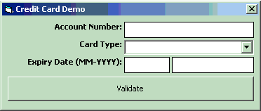



## Credit Card Validator

### Description

ActiveX DLL Project and accompanying demo to demonstrate LUHN Formula (Mod 10) for Validating Credit Card numbers.

Also validates the expiry dates to make sure card is not expired...

Validates following cards:

American Express

Diners Club

Discover

JCB

MasterCard

Visa

Fully commented and very usable functions provided within the DLL for use in many of your

credit card validation needs.

Once you properly register the DLL, try the demo...
 
### More Info
 

             |
---                |---
**Submitted On**   |2003-10-22 01:22:38
**By**             |[Foundations Software](https://github.com/Planet-Source-Code/PSCIndex/blob/master/ByAuthor/foundations-software.md)
**Level**          |Beginner
**User Rating**    |5.0 (10 globes from 2 users)
**Compatibility**  |VB 6\.0
**Category**       |[OLE/ COM/ DCOM/ Active\-X](https://github.com/Planet-Source-Code/PSCIndex/blob/master/ByCategory/ole-com-dcom-active-x__1-29.md)
**World**          |[Visual Basic](https://github.com/Planet-Source-Code/PSCIndex/blob/master/ByWorld/visual-basic.md)
**Archive File**   |[Credit\_Car16618110222003\.zip](https://github.com/Planet-Source-Code/foundations-software-credit-card-validator__1-49384/archive/master.zip)

